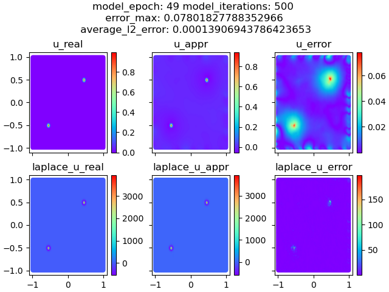

# KRnet_pytorch

KR net is a specific flow-based NN model

The **official** version: https://github.com/MJfadeaway/DAS

Another **unofficial** pytorch version (without PINNs) : https://github.com/CS-He/torchKRnet

This is the **unofficial** pytorch version implementation of the paper "DAS: A deep adaptive sampling method for solving high-dimensional partial differential equations".

## Numerical results

### 1 two peak possion

uniform resample



KR net resample (DAS)


### 2 deterministic lid driven cavity

uniform resample Re = 100


uniform resample Re = 400


For parameterized lid driven cavity flow problems (Re = [100,1000]), see: https://github.com/MJfadeaway/DAS-2 and cite 
```
@article{wang2024deep,
  title={Deep adaptive sampling for surrogate modeling without labeled data},
  author={Wang, Xili and Tang, Kejun and Zhai, Jiayu and Wan, Xiaoliang and Yang, Chao},
  journal={arXiv preprint arXiv:2402.11283},
  year={2024}
}
```

## Citation

If you find their work useful, please cite:

```
@article{tangdas,
  title={D{AS-PINN}s: {A} deep adaptive sampling method for solving high-dimensional partial differential equations},
  author={Tang, Kejun and Wan, Xiaoliang and Yang, Chao},
  journal={Journal of Computational Physics},
  volume={476},
  pages={111868},
  year={2022},
  publisher={Elsevier}
}
```